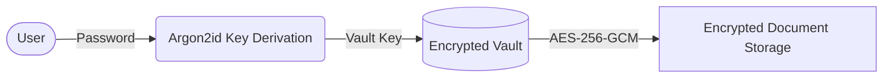
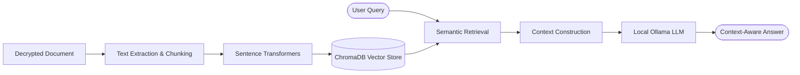
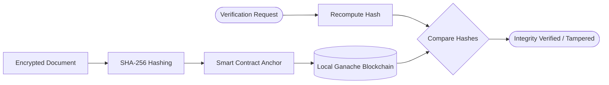
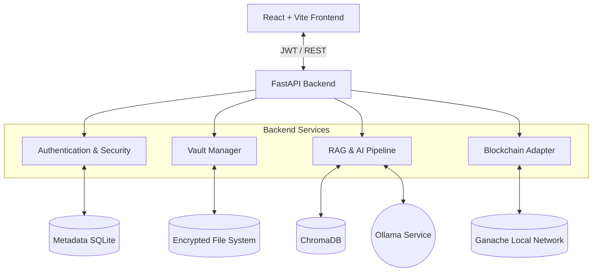

# Cipherix

> **Privacy-First AI Knowledge Vault with End-to-End Encryption and Blockchain Integrity**

[](https://www.python.org/downloads/release/python-3100/)
[](https://fastapi.tiangolo.com)
[](https://reactjs.org/)
[](https://vitejs.dev/)
[](https://ollama.ai)

## Overview

**Cipherix** is a local-first, zero-trust inspired platform designed to securely store, manage, and interact with your personal knowledge. Built on the philosophy that your data belongs entirely to you, Cipherix ensures that all sensitive documents remain on your machine, encrypted at rest, and completely inaccessible to cloud providers or unauthorized users.

By integrating advanced cryptography (AES-256-GCM, Argon2id) with local Artificial Intelligence (Ollama, ChromaDB), Cipherix acts as an intelligent vault. You can ask context-aware questions about your private documents using Retrieval-Augmented Generation (RAG) without ever transmitting text to a remote server. 

Additionally, a local blockchain layer anchors the SHA-256 hashes of your encrypted documents, allowing you to mathematically prove the integrity of your files over time and detect unauthorized tampering, all while maintaining absolute privacy.

## The Problem

Managing sensitive digital information today presents conflicting challenges:
- **Cloud Dependence**: Uploading private financial, legal, or personal documents to cloud-based AI tools (like ChatGPT or Google Drive) exposes them to data mining, breaches, and third-party access.
- **Searchability vs. Security**: Local encrypted storage is secure but extremely difficult to search intelligently. Finding specific insights across hundreds of encrypted PDFs is virtually impossible without decryption.
- **Data Integrity**: Detecting silent corruption, unauthorized alterations, or ransomware tampering on local files is difficult without cryptographic evidence.
- **Account Lockouts**: Strongly encrypted systems are fragile. A forgotten master password usually means total data loss because there is no "forgot password" button.

## The Solution

Cipherix solves these problems by combining four distinct technologies:
- **Encrypted Local Vault**: All documents are encrypted locally. The backend never persists plaintext master keys.
- **Local RAG Pipeline**: Documents are processed, embedded, and queried entirely on your local machine using open-source LLMs.
- **Blockchain Integrity Verification**: A smart contract deployed to a local Ganache network stores irreversible cryptographic hashes (not the documents themselves) to prove data integrity.
- **Custom Recovery Seed**: A robust 16-word emergency recovery mechanism allows you to securely regain access to your vault if you lose your password.

## Key Features

| Category | Feature | Description |
|---|---|---|
| **Security** | End-to-End Encryption | AES-256-GCM envelope encryption for vault keys and document contents. |
| **Security** | Key Derivation | Argon2id key derivation ensures master passwords are never stored. |
| **Intelligence** | Local Semantic Search | Sentence Transformers embeddings stored in ChromaDB. |
| **Intelligence** | Conversational AI (RAG) | Chat with your private documents locally via Ollama. |
| **Recovery** | 16-Word Recovery System | Custom, cryptographically secure recovery seed mechanism. |
| **Integrity** | Blockchain Anchoring | SHA-256 hashes anchored to a local blockchain for tamper detection. |

## How Cipherix Works

Cipherix separates document storage, AI processing, and integrity verification into distinct, secure pipelines.

### 1. Storage & Authentication


### 2. Local RAG Pipeline
*This pipeline strictly processes documents that the user has authorized and decrypted in memory.*


### 3. Blockchain Integrity Layer
*The blockchain never sees the document, embeddings, or keys. It only anchors a hash for future verification.*


## Architecture

Cipherix utilizes a modern, decoupled architecture:



## Security Architecture

Cipherix is built with defense-in-depth principles:
- **Encryption**: Uses `AES-256-GCM` to provide both confidentiality and authenticity for file contents.
- **Key Derivation**: Uses `Argon2id` (the industry standard for password hashing) to derive encryption keys locally. Master keys are never written to disk in plaintext.
- **Authentication**: Stateless `JWT` tokens handle session management.
- **Integrity, not Storage**: The blockchain is utilized strictly as an **integrity evidence layer**. No documents, keys, passwords, or recovery seeds are stored on the blockchain.
- **Local AI Only**: No cloud API keys are required. All embeddings and LLM inference run on the host machine.

## 16-Word Recovery System

To prevent catastrophic data loss from forgotten passwords, Cipherix implements a custom 16-word recovery mechanism.

- **Format**: It generates 16 words from the standard BIP-39 English wordlist.
- **Validation**: The 16th word acts as a SHA-256-based checksum, ensuring that mistyped seeds are immediately rejected. *(Note: This is a custom format, not standard 12/24 word BIP-39).*
- **Recovery Flow**:
  1. During vault creation, the user generates and securely writes down their 16 words.
  2. The system verifies the user correctly recorded the words via a confirmation UI.
  3. The seed derives a highly secure backup key which wraps the master vault key.
  4. If the user forgets their password, they navigate to the public `/recover` endpoint.
  5. By providing their username, the 16-word seed, and a new password, the system securely re-wraps the vault key, restoring access without exposing the vault contents.

## Local RAG Pipeline

Cipherix brings intelligent search directly to your local machine:
1. **Processing**: Authorized documents are decrypted in memory, parsed, and split into manageable semantic chunks.
2. **Embedding**: `Sentence Transformers` convert these chunks into vector representations locally.
3. **Storage & Retrieval**: Embeddings are stored in a local `ChromaDB` instance. When queried, the most relevant document context is retrieved.
4. **Generation**: The context is fed to a local `Ollama` LLM instance to generate a secure, private, context-aware response.

## Blockchain Integrity Layer

To guarantee that a document has not been subtly altered or corrupted over time:
1. When an encrypted document is saved, the system generates a `SHA-256` hash of the payload.
2. This hash is anchored into a smart contract on the local `Ganache` blockchain. 
3. When the user requests a verification check, the hash is recomputed from the live file and compared against the immutable blockchain record.
4. **The blockchain is used as an integrity evidence layer, not as document storage.**

## Technology Stack

| Layer | Technology |
|---|---|
| **Frontend** | React 19, Vite, React Router, Framer Motion, Lucide React |
| **Backend** | Python 3.10+, FastAPI, SQLAlchemy, Pydantic |
| **Database** | SQLite (Isolated, encrypted metadata databases per vault) |
| **Encryption** | AES-256-GCM, SHA-256 |
| **Authentication** | Argon2id, PyJWT |
| **AI / Machine Learning** | Sentence Transformers |
| **Vector Database** | ChromaDB |
| **LLM** | Ollama |
| **Blockchain** | Local Ganache network, Web3.py |
| **Smart Contracts** | Solidity, py-solc-x |
| **Testing** | `pytest` |

## Project Structure

```
Cipherix/
├── backend/
│   ├── app/
│   │   ├── api/           # FastAPI route handlers
│   │   ├── core/          # App configuration, logging, and exceptions
│   │   ├── database/      # SQLAlchemy models and SQLite sessions
│   │   ├── encryption/    # Cryptographic primitives (AES, Argon2id)
│   │   ├── schemas/       # Pydantic validation models
│   │   ├── security/      # Auth, passwords, and 16-word recovery logic
│   │   ├── services/      # Business logic (Vault, RAG, Blockchain, etc.)
│   │   └── vault/         # Vault filesystem and manifest management
│   ├── tests/             # Backend test suite (pytest)
│   └── requirements.txt
├── frontend/
│   ├── src/
│   │   ├── components/    # Reusable React components
│   │   ├── pages/         # Core views (Dashboard, Vault, Auth, Recovery, etc.)
│   │   ├── api.js         # HTTP client configuration
│   │   └── App.jsx        # Routing definitions
│   ├── package.json
│   └── vite.config.js
├── vaults/                # Encrypted user data storage
├── vector_db/             # Local ChromaDB persistence
└── README.md
```

## Getting Started

### Prerequisites
- Python 3.10+
- Node.js 18+
- [Ollama](https://ollama.ai) installed and running locally
- `ganache` CLI (`npm install -g ganache`)

### 1. Clone the Repository
```bash
git clone https://github.com/RACHITJAIN0804/Cipherix.git
cd Cipherix
```

### 2. Blockchain Setup
Start a local deterministic Ganache instance:
```bash
npx ganache --deterministic -p 8545
```
In a new terminal window, deploy the integrity smart contract:
```bash
cd backend
python -m app.services.blockchain.deploy
```

### 3. Backend Setup
Configure your Python environment and start FastAPI:
```bash
cd backend
python -m venv .venv
source .venv/bin/activate  # On Windows: .venv\Scripts\activate
pip install -r requirements.txt

# Start the server
python -m uvicorn app.main:app --reload --port 8000
```

### 4. Frontend Setup
Install dependencies and run the Vite dev server:
```bash
cd frontend
npm install
npm run dev
```
Navigate to `http://localhost:5173` in your browser.

## Testing

Cipherix maintains a comprehensive backend test suite to ensure cryptographic, authentication, and logical correctness.

To run the tests:
```bash
cd backend
python -m pytest
```

**Current Verification Status**:
- **Backend Tests**: 255 passed, 1 skipped, 0 failed.
- **Frontend Build**: Production build succeeds cleanly.

## Security Considerations

- **Excluded Sensitive Files**: `.gitignore` strictly prevents `.env` files, `.sqlite` databases, local `vaults/`, `key.json`, and `vector_db/` from entering version control.
- **No Plaintext Passwords**: Passwords and 16-word seeds are hashed on creation and never stored on disk.
- **Compartmentalized Data**: Each vault maintains its own isolated, encrypted metadata file.
- **Local Context Window**: Because Ollama runs locally, your unencrypted document text is strictly processed within your host machine's memory, never over the internet.
- **Separation of Concerns**: The blockchain layer records hashes of ciphertexts, preventing any inadvertent exposure of document metadata or semantic meaning.

## Demo Flow

To demonstrate the full capabilities of Cipherix:
1. **Onboarding**: Register a new user and login.
2. **Vault Setup & Backup**: Create a new vault. Generate and securely store the 16-word Recovery Seed.
3. **Document Ingestion**: Upload a sensitive document. It is automatically encrypted and stored locally.
4. **Integrity Anchoring**: The backend computes a SHA-256 hash of the encrypted payload and anchors it to the local Ganache blockchain.
5. **Knowledge Interaction**: Open the AI Assistant view and query your document to demonstrate the local RAG pipeline working seamlessly over decrypted-in-memory text.
6. **Integrity Check**: Trigger an integrity verification; the system will recalculate the hash, compare it against the blockchain record, and confirm it is untampered.
7. **Emergency Recovery**: Log out, simulate a forgotten password by navigating to `/recover`, input the 16-word seed and username, set a new password, and successfully restore access to the encrypted vault.

## Screenshots

*(Screenshots can be added here to showcase the Auth flow, Vault Dashboard, RAG Chat interface, and Recovery wizard.)*

## Limitations

As an academic/portfolio project, Cipherix currently has the following constraints:
- **Local Blockchain Scope**: Blockchain integrity relies on local Ganache. True decentralized immutability would require deployment to a public testnet/mainnet.
- **Hardware Requirements**: Encrypting and decrypting documents in memory, paired with local LLM inference, requires substantial local RAM and CPU/GPU capability.
- **Single-Node**: Designed as a local-first desktop-style application rather than a highly concurrent remote SaaS platform.

## Future Scope

- **Desktop Packaging**: Wrapping the frontend and backend into a single executable using Tauri or Electron.
- **Expanded Document Support**: Adding robust parsing for `.docx`, `.xlsx`, and images via local OCR.
- **Multi-Model Flexibility**: A UI toggle to easily swap between different local Ollama models.
- **Automated Vault Backups**: Securely syncing encrypted blobs to generic cloud storage providers while maintaining zero-knowledge guarantees.

## License

This project is licensed under the MIT License. See the [LICENSE](LICENSE) file for details.

## Authors

- **Rachit Jain**